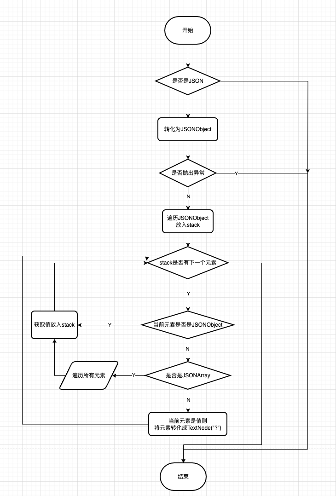

# 背景

ES集群采集了用户的请求后，希望能够将json中的值进行参数化，生成类似SQL指纹的json，然后根据指纹对ES请求中的JSON进行分类。来统计同一个指纹的请求的TPS，方便后续做请求统计分析。


# 需要收集json指纹的请求

- 采集_search请求的指纹，(忽略_bulk请求（_bulk的body是多个json组成))
- requestBody不为空
- requestBody为json

# 流程

## 生成json指纹流程

1. 将字符串转化为JSONObject

2. 递归遍历JSONObject中的所有元素，最终将最底层的value设置为"?"(不管原先的值是字符串还是数字)

3. 遍历元素时，如果当前元素是JSONObject则进行递归遍历，重复步骤2

4. 遍历元素时，如果当前元素是JSONArray，则对所有元素进行递归遍历，重复步骤2，所有元素转化完毕后，需要对数组中所有元素进行去重

   例如

   ```
   {"spuId":[123456,456789]}
   ```

   会转化为

   ```
   {"spuId":["?"]}
   ```

5. 遍历元素时，如果最底层是一个空的JSONObject，需要保留{}

6. 得到所有值都为"?"的json后，将json中所有的key取出来，排序

7. 将排序后的jsonKeys使用sha256生成指纹ID




# 示例

## 示例1

原始请求

```
{"size":20,"query":{"bool":{"filter":[{"term":{"brandId":{"value":9,"boost":1.0}}},{"terms":{"categoryId":[1000123],"boost":1.0}},{"term":{"isDel":{"value":0,"boost":1.0}}},{"term":{"status":{"value":1,"boost":1.0}}},{"term":{"bizType":{"value":0,"boost":1.0}}}],"adjust_pure_negative":true,"boost":1.0}},"_source":{"includes":["id"],"excludes":[]},"sort":[{"id":{"order":"asc"}}]}
```

指纹

```
{"size":"?","query":{"bool":{"filter":[{"term":{"brandId":{"value":"?","boost":"?"}}},{"terms":{"categoryId":["?"],"boost":"?"}},{"term":{"bizType":{"value":"?","boost":"?"}}},{"term":{"isDel":{"value":"?","boost":"?"}}},{"term":{"status":{"value":"?","boost":"?"}}}],"adjust_pure_negative":"?","boost":"?"}},"_source":{"includes":["?"],"excludes":[]},"sort":[{"id":{"order":"?"}}]}
```

jsonKeys

```
_source.includes.0,query.bool.adjust_pure_negative,query.bool.boost,query.bool.filter.0.term.brandId.boost,query.bool.filter.0.term.brandId.value,query.bool.filter.1.terms.boost,query.bool.filter.1.terms.categoryId.0,query.bool.filter.2.term.bizType.boost,query.bool.filter.2.term.bizType.value,query.bool.filter.3.term.isDel.boost,query.bool.filter.3.term.isDel.value,query.bool.filter.4.term.status.boost,query.bool.filter.4.term.status.value,size,sort.0.id.order
```

指纹ID

```
8c869dc621b45bf99a074c24020bed936b138cc0da81f91386fe45b1c83d4aca
```

## 示例2

原始json

```
{"query":{"bool":{"filter":[{"terms":{"spuId":[123456,456789],"boost":1.0}},{"terms":{"boost":1.0,"status":[0]}}],"adjust_pure_negative":true,"boost":1.0}}}
```

指纹

注意这里的数组做了合并

```
{"query":{"bool":{"filter":[{"terms":{"boost":"?","status":["?"]}},{"terms":{"spuId":["?"],"boost":"?"}}],"adjust_pure_negative":"?","boost":"?"}}}
```

jsonKeys

```
query.bool.adjust_pure_negative,query.bool.boost,query.bool.filter.0.terms.boost,query.bool.filter.0.terms.status.0,query.bool.filter.1.terms.boost,query.bool.filter.1.terms.spuId.0
```

指纹ID

```
9db8593a166479b33b019a49f162cf1c2ef84da6c33a5f8f7b7cc379e6a367b0
```

## 示例3

原始json

```
{"size":20,"query":{"bool":{}}}
```

指纹

```
{"size":"?","query":{"bool":{}}}
```

jsonKeys

```
query.bool,size
```

指纹ID

```
1a90a9d20bba5dec05f4aa591483469792d6d7d86dcd5304e6451e00106aff11
```


# 参考代码

```
public class JsonToolkit {

    private static final ObjectMapper OBJECT_MAPPER;

    static {
        ObjectMapper objectMapper = new ObjectMapper();
        // NOTE 为了保证生成指纹可靠性，不要设置JsonInclude.Include.NON_NULL
        objectMapper.disable(DeserializationFeature.FAIL_ON_UNKNOWN_PROPERTIES);
        objectMapper.configure(SerializationFeature.FAIL_ON_SELF_REFERENCES, false);
        OBJECT_MAPPER = objectMapper;
    }

    /**
     * 获取指纹ID,如果抛出异常了，则指纹ID为ERROR，如果json为空则返回NONE
     *
     * @param json json
     * @return 指纹ID
     */
    public static String fingerprintId(String json) {
        if (StringUtils.isBlank(json)) {
            return NONE;
        }
        try {
            String jsonKeys = jsonKeys(json);
            if (ERROR.equals(jsonKeys) || NONE.equals(jsonKeys)) {
                return jsonKeys;
            }
            // sha256
            return DigestUtils.sha256Hex(jsonKeys);
        } catch (Throwable e) {
            return ERROR;
        }
    }


    /**
     * 获取json中所有的key并进行排序
     *
     * @param json json
     * @return 排完序的json keys
     */
    public static String jsonKeys(String json) {
        if (StringUtils.isBlank(json)) {
            return NONE;
        }
        try {
            JsonNode jsonNode = OBJECT_MAPPER.readValue(json, JsonNode.class);
            // NOTE 这一步不能少，为了去除数组中的重复元素
            jsonNode = JsonToolkit.setUpDefaultValue(jsonNode);
            return JsonToolkit.jsonKeys(jsonNode);
        } catch (Throwable e) {
            return ERROR;
        }
    }


    /**
     * 获取指纹,如果抛出异常了，则指纹为ERROR，如果json为空则返回NONE
     *
     * @param json json
     * @return 指纹
     */
    public static String fingerprint(String json) {
        if (StringUtils.isBlank(json)) {
            return NONE;
        }
        try {
            JsonNode jsonNode = OBJECT_MAPPER.readValue(json, JsonNode.class);
            // NOTE 这一步不能少，为了去除数组中的重复元素
            jsonNode = JsonToolkit.setUpDefaultValue(jsonNode);
            return OBJECT_MAPPER.writeValueAsString(jsonNode);
        } catch (Throwable e) {
            return ERROR;
        }
    }


    /**
     * 获取json中所有的key并进行排序
     *
     * @param jsonObject jsonObject
     * @return 排完序的json keys
     */
    public static String jsonKeys(JsonNode jsonObject) {
        if (jsonObject == null) {
            return null;
        }
        List<String> keys = new ArrayList<>();
        Stack<Entry> stack = new Stack<>();
        stack.push(new Entry("", jsonObject));
        while (!stack.isEmpty()) {
            Entry entry = stack.pop();
            String prefix = entry.getKey();
            Object value = entry.getValue();

            if (value instanceof ObjectNode) {
                ObjectNode currentJsonObject = (ObjectNode) value;
                if (currentJsonObject.isEmpty()) {
                    if (prefix.length() >= 1) {
                        keys.add(prefix.substring(0, prefix.length() - 1));
                    }
                } else {
                    Iterator<Map.Entry<String, JsonNode>> fields = currentJsonObject.fields();
                    while (fields.hasNext()) {
                        Map.Entry<String, JsonNode> subEntry = fields.next();
                        stack.push(new Entry(prefix + subEntry.getKey() + ".", subEntry.getValue()));
                    }
                }
            } else if (value instanceof ArrayNode) {
                ArrayNode currentJsonArray = (ArrayNode) value;
                for (int i = 0; i < currentJsonArray.size(); i++) {
                    stack.push(new Entry(prefix + i + ".", currentJsonArray.get(i)));
                }
            } else {
                keys.add(prefix.substring(0, prefix.length() - 1));
            }
        }
        Collections.sort(keys);
        return String.join(",", keys);
    }


    /**
     * 将json中所有的value值设置为?,如果遇到数组则对相同的值进行合并
     *
     * @param jsonObject
     * @return json中所有的value值设置为?
     */
    public static JsonNode setUpDefaultValue(JsonNode jsonObject) {
        return doSetUpDefaultValue(jsonObject);
    }

    /**
     * 将json中所有的value值设置为?,如果遇到数组则对相同的值进行合并
     *
     * @param value 可能为jsonObject、jsonArray、其他类型
     * @return json中所有的value值设置为?
     */
    public static JsonNode doSetUpDefaultValue(JsonNode value) {
        if (value instanceof ObjectNode) {
            ObjectNode jsonObject = (ObjectNode) value;

            Iterator<Map.Entry<String, JsonNode>> fields = jsonObject.fields();

            while (fields.hasNext()) {
                Map.Entry<String, JsonNode> entry = fields.next();
                JsonNode entryValue = entry.getValue();
                entry.setValue(doSetUpDefaultValue(entryValue));
            }
        } else if (value instanceof ArrayNode) {
            ArrayNode jsonArray = (ArrayNode) value;
            for (int i = 0; i < jsonArray.size(); i++) {
                JsonNode currentVal = jsonArray.get(i);
                jsonArray.set(i, doSetUpDefaultValue(currentVal));
            }
            // NOTE 针对多个值进行去重
            Set<JsonNode> unionObjSet = new HashSet<>();
            Iterator<JsonNode> iterator = jsonArray.iterator();
            while (iterator.hasNext()) {
                unionObjSet.add(iterator.next());
            }

            jsonArray.removeAll();
            jsonArray.addAll(unionObjSet);
        } else {
            value = new TextNode("?");
        }
        return value;
    }


    @Data
    @NoArgsConstructor
    @AllArgsConstructor
    public static class Entry {

        private String key;

        private Object value;

    }
```

